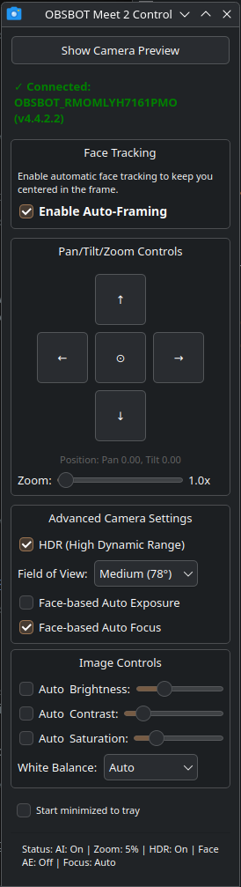
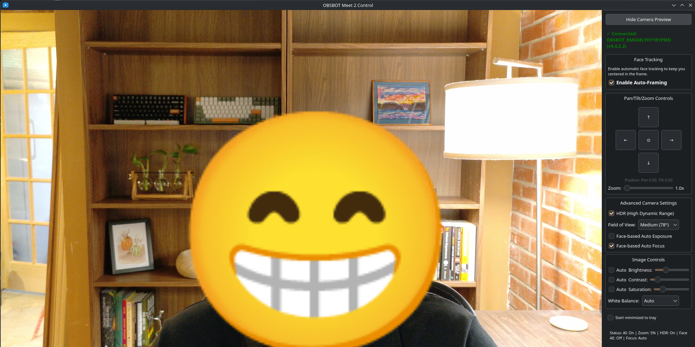

# OBSBOT Control for Linux


A native Qt6 application for controlling OBSBOT cameras on Linux. Provides full camera control with an intuitive GUI while allowing simultaneous use with streaming/conferencing software.

**Primary targets**: OBSBOT Tiny 2, OBSBOT Meet 2
**Community-tested**: Tiny 2 Lite, Tiny 4K, Meet SE (see [Compatibility](#compatibility))

## Screenshots

<p align="center">
  
  
</p>

*Left: Main control interface with PTZ controls, auto-framing, and advanced settings. Right: Live preview showing face tracking in action.*

## Features

### Camera Control
- **Pan/Tilt/Zoom (PTZ)** - Precise camera positioning with center reset
- **Auto-Framing** - AI-powered face tracking with single/upper body modes
- **Image Settings** - Brightness, contrast, saturation with auto/manual modes
- **Field of View** - Wide (86°), Medium (78°), Narrow (65°)
- **HDR** - High Dynamic Range for better exposure
- **Face AE/Focus** - Face-based auto exposure and auto focus
- **White Balance** - Multiple presets (auto, daylight, fluorescent, etc.)

### Live Preview
- **Camera Preview** - Real-time video preview with automatic aspect ratio detection
- **Usage Detection** - Warns when camera is in use by other applications (Chrome, OBS, Zoom)
- **Resource Management** - Automatically releases camera when not needed
- **Intelligent Layout** - Window expands only when preview successfully opens
- **GPU Filters** - Apply GLSL-driven color filters with adjustable intensity for both preview and virtual camera output

### System Integration
- **System Tray** - Minimize to tray, click to restore
- **Start Minimized** - Optional startup directly to system tray
- **Auto-Reconnect** - Reconnects to camera when window is restored
- **State Preservation** - Remembers preview state across hide/show cycles

### Configuration
- **Persistent Settings** - All camera settings saved to XDG-compliant config file
- **Startup Restore** - Camera returns to saved state on connection
- **Manual Control** - Config file is human-readable and editable
- **Validation** - Helpful error messages for invalid configuration

## Why This Matters

OBSBOT cameras have excellent Linux UVC support, but lack native control software. This application:

1. **Simultaneous Use** - Control camera settings while OBS/Chrome streams video
2. **Resource Friendly** - Releases camera when minimized/hidden
3. **Native Performance** - Qt6 application, not Electron
4. **Standard Compliance** - Uses XDG config directories, system tray

## Compatibility

| Camera | Status | Notes |
|--------|--------|-------|
| **OBSBOT Tiny 2** | Full | Primary development target. All features supported. |
| **OBSBOT Meet 2** | Full | All features supported. |
| **OBSBOT Tiny 2 Lite** | Partial | Detection works. Preview device path needs SDK fix. ([#8](https://github.com/aaronsb/obsbot-camera-control/issues/8)) |
| **OBSBOT Tiny 4K** | Partial | PTZ, HDR, manual image controls work. Auto-framing and face AE/focus don't. ([#13](https://github.com/aaronsb/obsbot-camera-control/issues/13), [#7](https://github.com/aaronsb/obsbot-camera-control/issues/7)) |
| **OBSBOT Meet SE** | Partial | Basic compatibility confirmed. ([#9](https://github.com/aaronsb/obsbot-camera-control/issues/9)) |

The SDK also lists: Tiny (original), Tiny SE, Meet (original), Meet 4K, Me, Tail Air, Tail 2, Tail 2S, HDMI Box, NDI Box. These are untested — if you have one, [open a compatibility report](https://github.com/aaronsb/obsbot-camera-control/issues/new?template=device_compatibility.md).

## Requirements

### System
- Linux (tested on Arch Linux with KDE Plasma)
- OBSBOT camera (USB connection - see [Compatibility](#compatibility))
- System tray support (KDE, GNOME, etc.)

### Build Dependencies
- Qt6 (Core, Widgets, Multimedia)
- CMake 3.16+
- C++17 compiler (GCC/Clang)
- OBSBOT SDK (included in `sdk/` directory)
- OpenCV 4 (optional; enables automatic paper-boundary detection and perspective correction)

### Runtime Dependencies
- Qt6 libraries
- V4L2 (Video4Linux2) support
- `lsof` for camera usage detection (optional but recommended)
- OpenCV 4 is only required when automatic paper crop is desired; manual crop works without it

## Quick Start

### One-Line Install

For the adventurous, a single command that clones the repo to `~/src/obsbot-camera-control` and builds/installs:

```bash
curl -fsSL https://raw.githubusercontent.com/aaronsb/obsbot-camera-control/main/local-install.sh | bash
```

⚠️ **What this does:**
- Clones repository to `~/src/obsbot-camera-control`
- Checks dependencies (shows what to install if missing)
- Builds and installs the application
- Adds desktop launcher to your app menu

### Standard Install

If you prefer to review the code first (recommended):

```bash
# Clone and build
git clone https://github.com/aaronsb/obsbot-camera-control.git
cd obsbot-camera-control
./build.sh install --confirm
```

The build script automatically:
- ✅ Checks dependencies (shows install commands for your distro)
- ✅ Builds the application
- ✅ Installs to `~/.local/bin`
- ✅ Adds desktop launcher to your app menu
- ✅ Offers to update your PATH if needed

**Common Commands:**
```bash
./build.sh build --confirm    # Build only
./build.sh install --confirm  # Build and install
./build.sh help              # Show all options
./uninstall.sh --confirm     # Remove installation
```

📖 **[Detailed Build Instructions →](docs/BUILD.md)** - Dependencies, manual build, troubleshooting

## Usage

### First Run
1. Connect your OBSBOT camera via USB
2. Launch application
3. Camera connects automatically
4. Adjust settings as desired
5. Settings auto-save to `~/.config/obsbot-control/settings.conf`

### Camera Preview
- Click **"Show Camera Preview"** to enable live preview
- If another app is using the camera, you'll see a warning with the process name
- Close the blocking application and try again
- Preview automatically disabled when window is hidden/minimized
- Use the **Filter** controls above the preview to apply GPU shaders (None, Grayscale, Sepia, Invert, Warm, Cool) and tune their intensity. Changes appear instantly in the preview and in the virtual camera stream.

### Virtual Camera
- Packages ship the systemd unit and modprobe configuration needed for a virtual camera, but they are **not** enabled automatically.
- When you want the feature, either enable the service or load the module manually:
  ```bash
  sudo systemctl enable --now obsbot-virtual-camera.service
  # or
  sudo modprobe v4l2loopback video_nr=42 card_label="OBSBOT Virtual Camera" exclusive_caps=1
  ```
- The app shows whether the virtual camera device exists and gives setup guidance directly in the UI.
- Once the module is active, toggle **Virtual Camera → Enable virtual camera output** inside the app to feed OBS/Zoom/Meet.

### Model-Specific Extras
- OBSBOT Tiny 2 family cameras expose additional controls (voice command toggles, LED brightness, microphone pickup distance) through the SDK.
- The desktop app keeps these switches hidden so other models don’t surface unusable options. Advanced users can experiment via the CLI/SDK if needed.

### System Tray
- Click **X** button to minimize to tray (doesn't quit)
- Click tray icon to show/hide window
- Right-click tray icon for menu
- Enable **"Start minimized to tray"** checkbox for startup behavior

### Workflow Example
Perfect for streaming/conferencing:

1. Start app (optionally minimized to tray)
2. Open OBS and select your OBSBOT camera as video source
3. Click tray icon to show control window
4. Adjust zoom, framing, brightness during stream
5. Hide window to tray when not needed
6. Camera remains available to OBS the entire time

## Configuration

Settings are stored in: `~/.config/obsbot-control/settings.conf`

### Configuration Format
```ini
# Camera Settings
face_tracking=enabled
hdr=disabled
fov=wide
face_ae=enabled
face_focus=enabled
zoom=1.0
pan=0.0
tilt=0.0

# Image Controls
brightness_auto=enabled
brightness=128
contrast_auto=enabled
contrast=128
saturation_auto=enabled
saturation=128
white_balance=auto

# Application Settings
start_minimized=disabled
```

### Manual Editing
- Boolean values: `enabled`/`disabled`, `true`/`false`, `yes`/`no`, `1`/`0`
- FOV values: `wide`/`medium`/`narrow` or `0`/`1`/`2`
- Zoom: `1.0` to `2.0`
- Pan/Tilt: `-1.0` to `1.0` (0 is center)
- Brightness/Contrast/Saturation: `0` to `255`

## Technical Details

### Architecture
- **Control Interface (SDK)** - USB control endpoint for camera settings
  - Can be used simultaneously by multiple applications
  - Always available when camera is connected

- **Video Stream (V4L2)** - `/dev/video*` device for preview
  - Exclusive access (one app at a time)
  - Preview optional - controls work without it

### Camera Detection
- Automatically finds OBSBOT camera in video device list
- Uses `lsof` to detect which process has video device open
- Filters out own process (control and preview can coexist)

### Resource Management
When window is hidden/minimized:
1. Preview state is saved
2. Preview is disabled if enabled
3. Camera SDK handle is released
4. Other applications can now access camera

When window is shown/restored:
1. Reconnects to camera control interface
2. Waits 1 second for stability
3. Attempts to restore preview if it was enabled
4. Shows warning if preview fails (camera in use)

## Troubleshooting

### Camera not detected
- Check USB connection: `lsof /dev/video0` (adjust device number)
- Verify udev permissions: User should be in `video` group
- Check kernel messages: `dmesg | grep -i video`

### Preview shows wrong camera
- Application auto-detects OBSBOT by name
- If multiple cameras, OBSBOT is selected by description match
- Fallback uses Qt6 Multimedia default camera

### Can't enable preview
- Orange warning shows which process is using camera
- Close blocking application (Chrome, OBS, Zoom, etc.)
- Click "Show Camera Preview" again
- Note: Controls work without preview!

### Scene Presets, Manual Positioning, and Paper Crop

Presets now save a complete scene: tracking/manual mode, AI mode and its focus/zoom/speed profile, pan, tilt, zoom, and paper-crop settings.

On Tiny 2-family cameras, **Group**, **Human**, **Hand**, **Whiteboard**, and **Desk** each retain an independent focus policy, saved manual-focus position, AI auto-zoom setting, and tracking speed. Select a mode before editing these controls; switching back restores that mode's profile. Turning tracking off disables face focus and restores the retained manual-focus position before manual movement is authorized.

**Create a fixed table view:**
1. In **Tracking**, check **Enable manual positioning (turns tracking off)**. Manual intent remains latched until you explicitly re-enable tracking. The controls briefly show a waiting state and unlock only after the camera freshly confirms that tracking is off; if confirmation fails, movement stays disabled and an error is shown.
2. Position and zoom the camera with the now-enabled manual controls.
3. Enable the preview. In **Creative FX → Paper Crop**, choose **Manual rectangle** or **Automatic paper detection** and adjust the fallback crop sliders. Automatic mode needs all four paper edges visible. Its status reports whether the page is locked or still being searched for; brief detection loss holds the last good boundary before using the saved manual fallback.
4. In **Presets**, save this as the table scene.
5. Re-enable tracking, configure the normal face view, disable paper crop, and save that as another scene.
6. Recall scenes with their buttons or `Ctrl+1`, `Ctrl+2`, or `Ctrl+3`.

On Tiny 2-family cameras, selecting or recalling **Automatic paper detection** also switches to the saved **Desk** profile and persists crop and tracking together. Turning paper crop off leaves Desk mode active until another mode is selected explicitly. Desk mode controls framing in the **direct physical camera feed**; software paper detection and perspective correction affect only the app preview, snapshots, and **OBSBOT Virtual Camera** output. Conferencing software must select the virtual camera to receive that processed image.

For a desktop-wide hotkey, bind:

```bash
obsbot-cli --preset 1
obsbot-cli --preset 2
obsbot-cli --preset 3
```

When the GUI is running, the CLI routes scene recall through it so tracking and software crop are restored too. Without the GUI, the CLI falls back to camera-side tracking/PTZ/zoom only. Use `obsbot-cli --list-presets` to inspect saved scenes. If multiple cameras are connected and the GUI is not running, add `--serial SERIAL`.

### Settings not saving
- Check config directory exists: `~/.config/obsbot-control/`
- Verify write permissions
- Look for validation errors in config dialog

### System tray icon not showing
- Verify system tray support (KDE, GNOME extension, etc.)
- Check Qt6 platform plugin: `export QT_QPA_PLATFORMTHEME=qt6ct`
- Some minimal window managers lack system tray

## Command Line Interface

A CLI tool is also included for automation/scripting:

```bash
./obsbot-cli
```

See CLI help for available commands.

Useful automation commands:

```bash
obsbot-cli --list-presets              # Show saved scenes
obsbot-cli --preset 1                  # Recall scene 1
obsbot-cli --preset 1 --serial ABC123  # Select an exact camera
```

## Project Structure

```
obsbot-camera-control/
├── src/
│   ├── gui/           # Qt6 GUI application
│   ├── cli/           # Command-line interface
│   └── common/        # Shared configuration code
├── sdk/               # OBSBOT SDK (closed-source library + headers)
├── resources/         # Icons and resources
└── CMakeLists.txt     # Build configuration
```

## Contributing

Contributions welcome. See [CONTRIBUTING.md](CONTRIBUTING.md) for build instructions, code style, and project structure.

## Credits

- OBSBOT for creating excellent Linux-compatible cameras and providing the SDK
- Qt Project for the excellent framework
- Linux community for V4L2 support

## License

MIT License — see [LICENSE](LICENSE) for details.

The OBSBOT SDK (`sdk/`) is distributed by OBSBOT without a license. This is an unofficial third-party application, not affiliated with or endorsed by OBSBOT.
